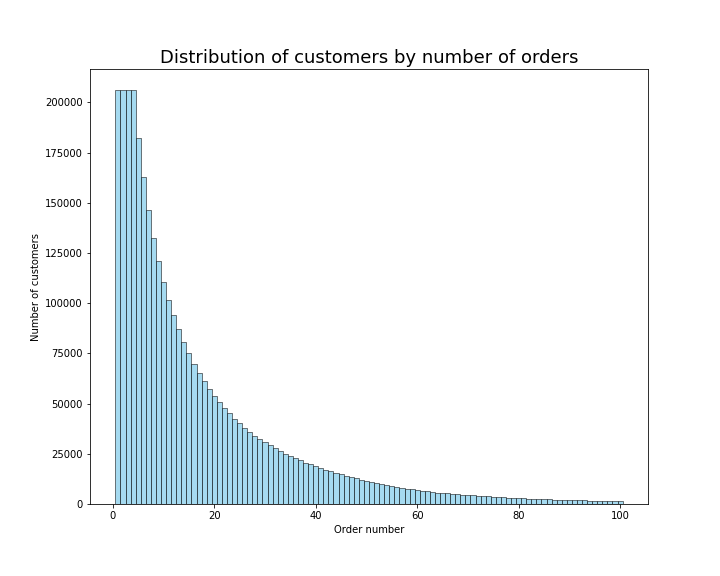
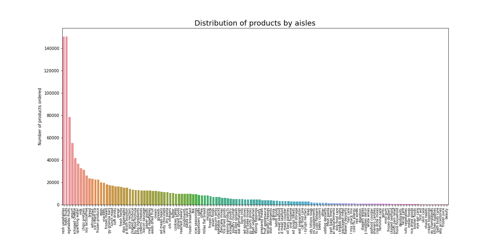
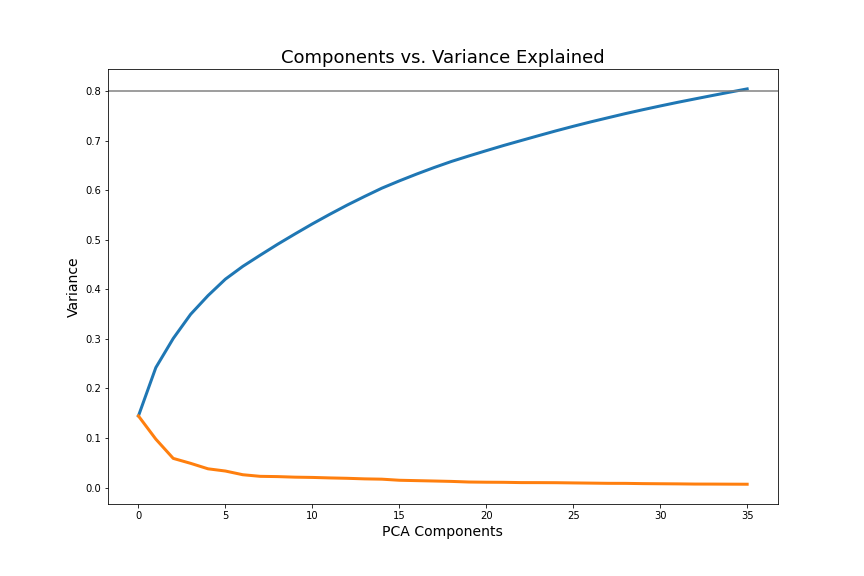
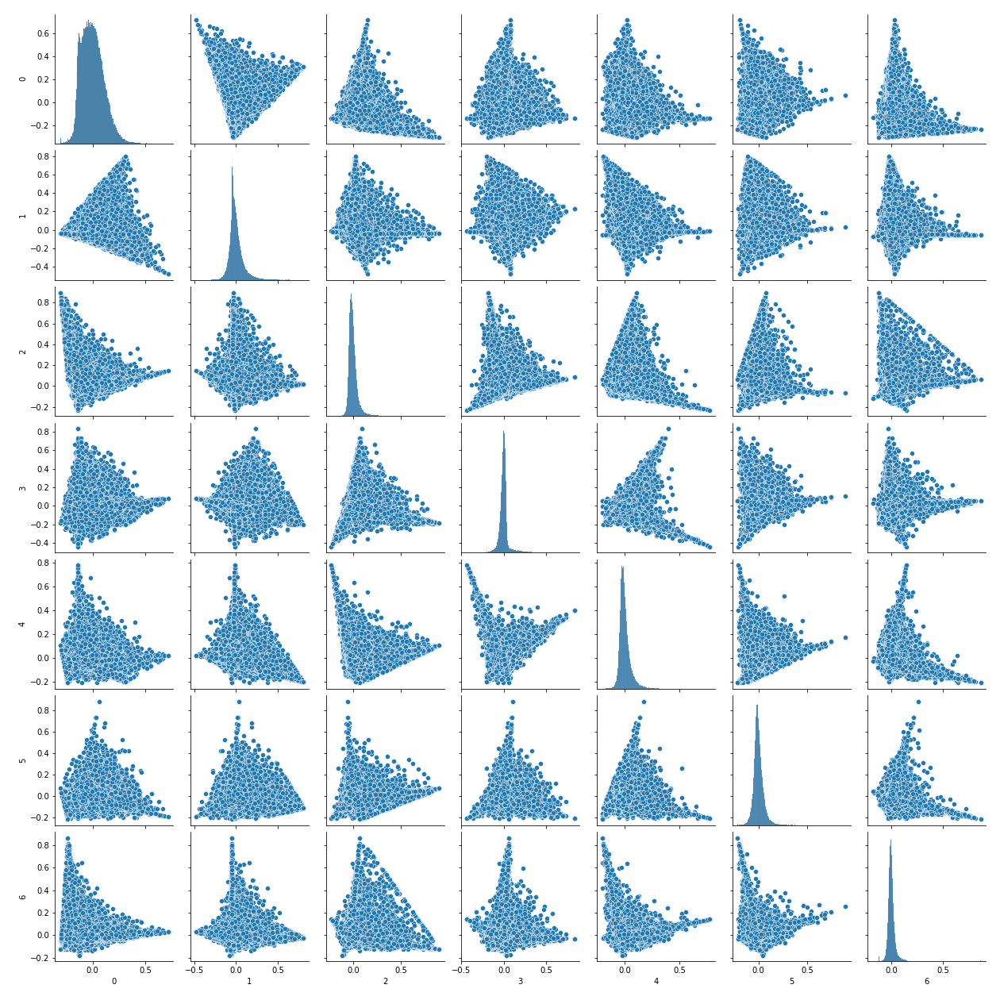
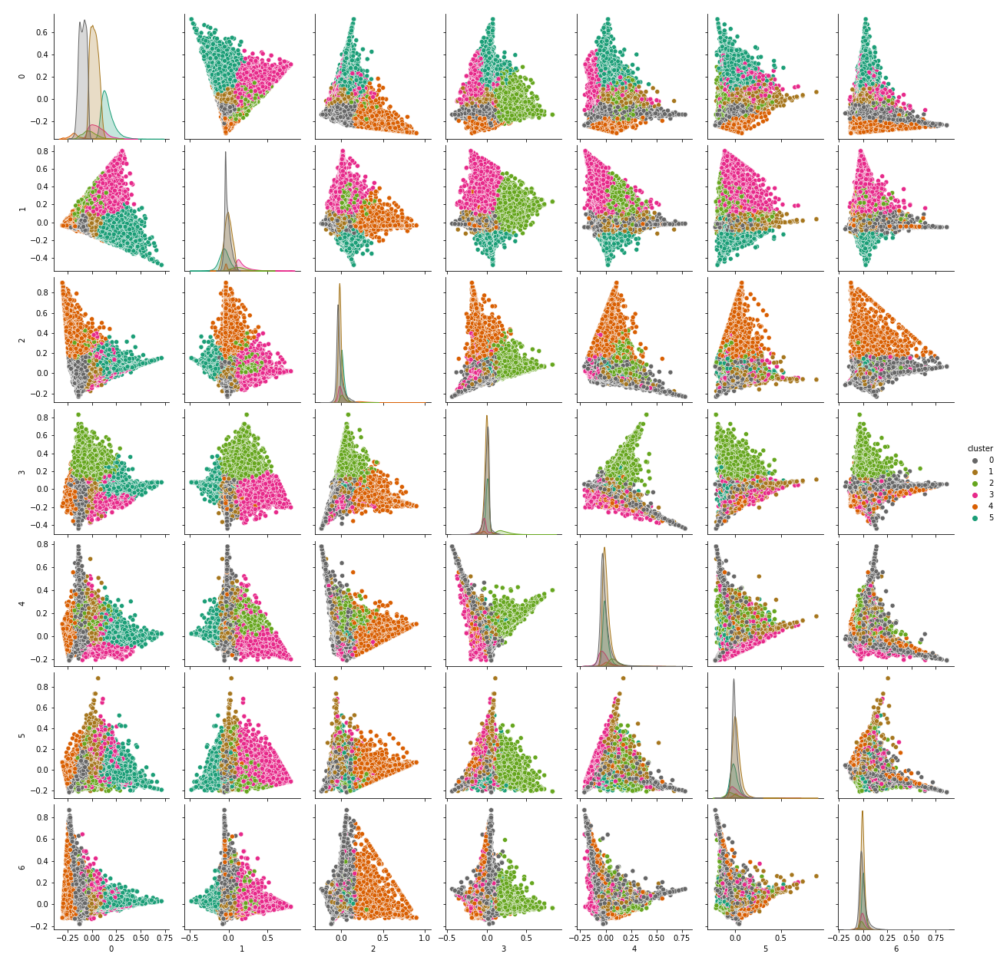
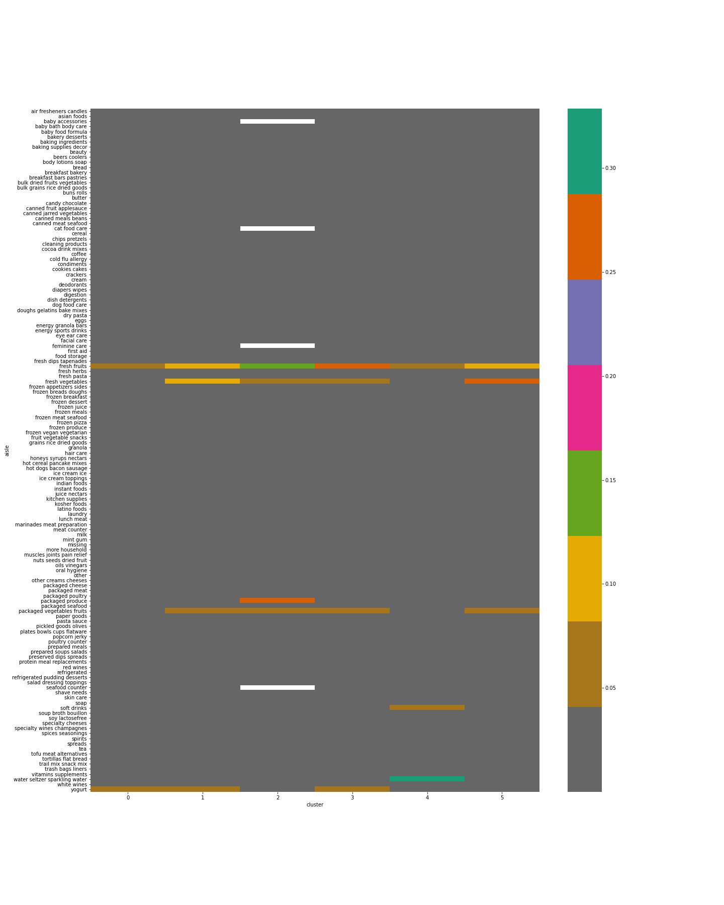
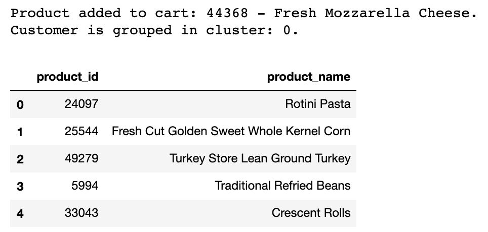
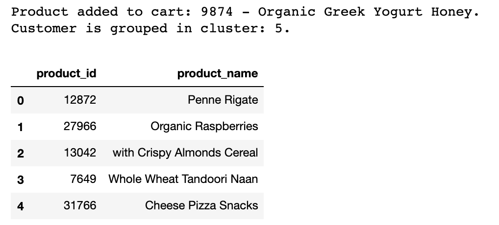

# Instacart Recommender System
---

## Preamble
This project looks at developing a recommender system for e-grocers based on Association Rule Mining(ARM), with the objective to develop a model that provides relevant recommendations to a customer based on a product that has been added to cart.

---

## Contents
* [1. Problem Statement](#chapter1)
    * [1.1 Context & Motivation](#chapter1_1)
    * [1.2 Primary & Secondary Stakeholders](#chapter1_2)
    * [1.3 Problem Statement](#chapter1_3)
* [2. Data Dictionary](#chapter2)
    * [2.1 Aisle Data](#chapter2_1)
    * [2.2 Deparment Data](#chapter2_2)
    * [2.3 Order Products Data](#chapter2_3)
    * [2.4 Orders Data](#chapter2_4)
    * [2.5 Products](#chapter2_5)
* [3. Executive Summary](#chapter3)
    * [3.1 Context & Initial Assumptions](#chapter3_1)
    * [3.2 Data Science Process](#chapter3_2)
    * [3.3 Key Findings](#chapter3_3)
* [4. Recommendations & Conclusion](#chapter4)
    * [4.1 Addressing Problem Statement](#chapter4_1)
    * [4.2 Opportunities and Next Steps](#chapter4_2)
* [5. Citations](#chapter5)

## 1. Problem Statement 

### 1.1 Context & Motivation 
COVID-19 has accelerated the growth of e-commerce activities. With local e-grocers such as Redmart experiencing growth of about [4 times](https://www.cnbc.com/2020/06/02/coronavirus-singapore-online-grocery-sales-lazada.html), it has become increasingly important to be able to recommend customers relevant products to reduce churn and increase sales. 

However, unlike traditional retail stores, e-grocers do not have the advantage of having taste booths, or opportunities for customers to chance upon new products while exploring down the aisles. To push products to customers, e-grocers rely on precious screen real estate to recommend products. Furthermore, due to data protection rights, e-grocers are not able to collect demographic information on their customers in order to profile and effectively target different groups. 

### 1.2 Primary & Secondary Stakeholders 
|Type|Stakeholders|Value Proposition|Problem Type|
|:--|:--|:--|:--|
|Primary|Product Team|- Effectively recommend relevant products for customers - Improve customer experience - Reduce churn and increase sales|Business|
|Secondary|Commercial Team|- With better understanding of customer behaviour, source for products that customers are interested in - Better targeting ability with promotions|Business|

### 1.3 Problem Statement 
Without having demographic information, it is difficult for e-grocers to effectively identify customer groups. Unlike general e-commerce such as Shopee or Lazada, where customers do not need to build a basket of goods, e-grocers have the advantage of customers building a basket with goods coming from a mix of different categories. This provides e-grocers with data on basket mix preferences.

Clustering techniques will be explored to see if customers can be effectively grouped into different categories. Based on the preferences of these different groups, a recommendation system based on association rule learning will be designed to effectively recommend relevant products to customers that are not just products that are past purchases or products within the same category, with the objective to increase sales in increasing product exposure and also improving overall customer experience.

## 2. Data Dictionary 
Data used is provided by Instacart and is split into the following:
- Aisle Data
- Department Data
- Order Products Data
- Orders Data
- Products Data

[Remote stored data](https://drive.google.com/drive/folders/1UOUa4Pe6hl3ARkKNuCRzoL1Ie70PJoRV)

[Kaggle Link](https://www.kaggle.com/c/instacart-market-basket-analysis/data)

### 2.1 Aisle Data 
|Column|Data Type|Description|
|:--|:--|:--|
|`aisle_id`|int64|Unique identifier for aisle.|
|`aisle`|object|Name of aisle.|

### 2.2 Department Data 
|Column|Data Type|Description|
|:--|:--|:--|
|`department_id`|int64|Unique identifier for department.|
|`department`|object|Name of department.|

### 2.3 Order Products Data 
|Column|Data Type|Description|
|:--|:--|:--|
|`order_id`|int64|Unique identifier of order.|
|`product_id`|int64|Unique identifier of product.|
|`add_to_cart_order`|int64|Quantity of product added to cart.|
|`reordered`|int64|Boolean indicator if the order is a reordered product or not.|

### 2.4 Orders Data 
|Column|Data Type|Description|
|:--|:--|:--|
|`order_id`|int64|Unique identifier of order.|
|`user_id`|int64|Unique identifier of user.|
|`order_number`|int64|Indicated the nth order of a user.|
|`order_dow`|int64|Indicates day order was made.|
|`days_since_prior_order`|float64|Indicates hour of the day the order was made.|

### 2.5 Products Data 
|Column|Data Type|Description|
|:--|:--|:--|
|`product_id`|int64|Unique identifier of product.|
|`product_name`|object|Product name.|
|`aisle_id`|int64|Unique identifier for aisle.|
|`department_id`|int64|Unique identifier for department.|

## 3. Executive Summary 

### 3.1 Context & Initial Assumptions 
The data provides consumption patterns for products spread across users. Based on the data, clustering techniques will be employed to group customers and the apriori algorithm will be applied to item pairs within the clusters.

### 3.2 Data Science Process 
The target is to develop a recommender system for grocery products, which is an unsupervised learning problem based on implicit data. Process to develop the system will be as follows.

1. [EDA](./code/01_eda.ipynb)
 - Problem Statement
 - Data Inspection
 - EDA
 - EDA Findings
2. [Data Processing](./code/02_data_processing.ipynb)
 - Data Preparation
 - Pricipal Component Analysis (PCA)
 - K-Means Clustering
3. [Association Rules](./code/03_association_rules.ipynb)
 - Association Rule Mining
4. [Recommender](./code/04_recommender.ipynb)
 - Defining Recommender
 - Recommender Evaluation
 - Conclusion
 
### 3.3 Key Findings 

#### 3.3.1 EDA
The data used consists on 3.4 million orders spread across 206k customers. These customers have all made at least 4 orders within the data set, eliminating issues with cold start. 

Given the number of aisles, customers will be clustered based on their basket mix of products from different aisles.

#### 3.3.2 Data Processing
Due to the large number of orders and aisles, Principal Component Analysis (PCA) was employed to reduce the number of features. PCA effectively reduced the number of features from 134 to 36, with 80% of the variance in the original distribution explained.

K-Means clustering was then used to split customers into 6 different groups.

As PCA was employed, inference on what factors were used to cluster into 6 different groups was lost. The cluster was assigned back to the original data to identify different preferences for inferential purposes.

#### 3.3.3 Association Rules
After the clusters were identified, the data was split into the different clusters and metrics from the apriori algorithm were computed for item pairs. These metrics include:
- Support: Probability of an item pair appearing in the dataset
- Confidence: Probability of a given item pair A & B given item A
- Lift: Ratio of Confidence to Support

The end results was item pairs from the different clusters with their corresponding apriori metrics.

#### 3.3.4 Recommender
Based on the metrics computed, the recommender pushes across products with the highest lift values when a customer adds a certain product to cart.

Some results are shown.

## 4. Recommendations & Conclusion 

### 4.1 Addressing Problem Statement 
The clustering techniques can help to cluster customers into different groups based on their varying preferences for products in different aisles. Based on this cluster, the recommender also pushes across products that are closely associated based on lift values. 

The products pushed may not necessarily be from the same category, which leads to increased exposure of products in varying categories. The recommender is also able to provide different recommendations to custoemrs from different clusters based on their preferences, catering for the varying preferences in each customer group.

Based on the results, the recommender seems to effectively provide relevant recommendations to help improve overall sales and improve customer experience.

### 4.2 Opportunities and Next Steps 
Following this, the recommender should be put through A/B testing to properly evaluate its effectiveness, given that this is an unsupervised learning problem. Metrics used to measure success are proposed as the following:
- Average order value
- Average number of new items added to cart
- Click through rate and converion of recommendations
- Customer churn rate

Additionally, further opportunities can be explored in modifying the logic of the recommender to prioritise products according to specifications provided by category managers. For example, if there are certain products that have a higher margin compared to others, or products that are on sale, these products can be prioritised in order to strategically target customer groups and increase sales.

Also, clustering is currently based on aisle mix. However, EDA revealed that certain aisles have a high number of products compared to others. Densely populated aisles can be further broken down into different categories (vegetables to asian vegetables, salads etc) and less dense aisles can be combined together to help improve the clustering. Additional information such as customer order frequency or average order value can also be useful indicators in grouping customer groups.

## 5. Citations 

“The Instacart Online Grocery Shopping Dataset 2017”, Accessed from https://www.instacart.com/datasets/grocery-shopping-2017

Grover, P. (2020, March 31). Various implementations of collaborative filtering. Retrieved February 25, 2021, from https://towardsdatascience.com/various-implementations-of-collaborative-filtering-100385c6dfe0

Majithiya, D. (2019, November 12). Recommendation system USING association rule mining for implicit data. Retrieved February 25, 2021, from https://medium.datadriveninvestor.com/recommendation-system-using-association-rule-mining-for-implicit-data-6fba0f6c5012

Association rule learning. (2021, February 16). Retrieved February 25, 2021, from https://en.wikipedia.org/wiki/Association_rule_learning#Support
